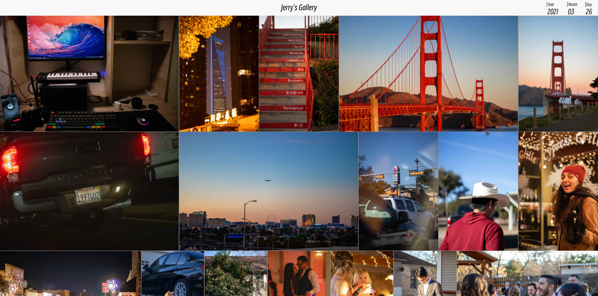

>This gallery base on [Gallery Deluxe](https://github.com/bep/gallerydeluxe) and [arc](https://github.com/Sped0n/gallerydeluxe)

* [Configuration](#configuration)
* [Credits](#credits)

A Hugo Module to show a photo gallery. It's very fast/effective, especially if you have lots of images on display.

This theme is what you see on [jerrysmd.github.io/gallery](https://jerrysmd.github.io/gallery/) which, at the time of writing this, [scores 100](https://pagespeed.web.dev/report?url=https%3A%2F%2Fstaticbattery.com%2F&form_factor=mobile) at Google PageSpeed for both mobile and desktop.



## Configuration

The recommended way to add this to your site is to include it as a Hugo Module. See [Gallery Deluxe Starter](https://github.com/bep/gallerydeluxe_starter) for a starter template. Another example is [staticbattery.com](https://github.com/bep/staticbattery.com).


### Params

```toml
[params]
    [params.gallerydeluxe]
        # Shuffle the images in the gallery to give the impression of a new gallery each time.
        shuffle = false

        # Reverse the order of the images in the gallery.
        reverse = false

         # Enable Exif data in the gallery.
         # See https://gohugo.io/content-management/image-processing/#exif-data for how to filter tags.
        enable_exif = false
```


## Credits

Credit to Dan Schlosser for the [Pig](https://github.com/schlosser/pig.js) JS library. 
